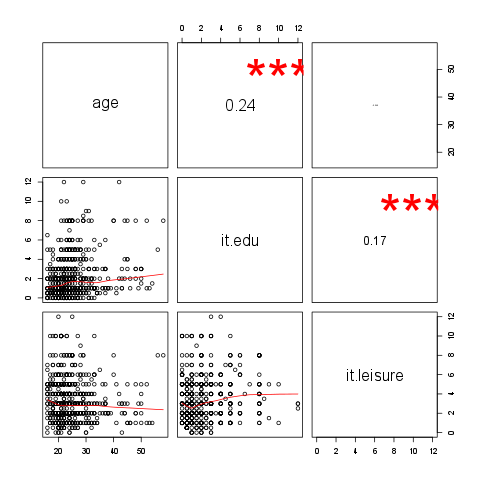

% Correlations
% (Username not set) (E-mail address not set)
% 2011-04-26 20:25 CET

## Description

This template will return the correlation matrix of supplied numerical
variables.

### Variable description

3 variables provided.

The highest correlation coefficient (0.2364) is between "it.edu" and
"age" and the lowest (-0.049) is between "it.leisure" and "age". It
seems that the strongest association (r=0.2364) is between "it.edu" and
"age".

Higly correlated (r < 0.7 or r \> 0.7) variables: -

Uncorrelated (-0.2 < r < 0.2) variables: \* "age" - "it.leisure" \*
"it.edu" - "it.leisure"

#### Correlation matrix

