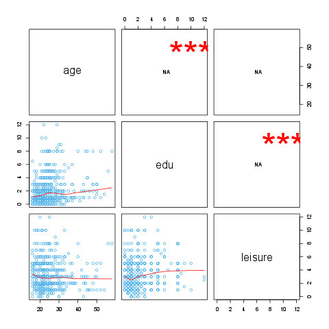
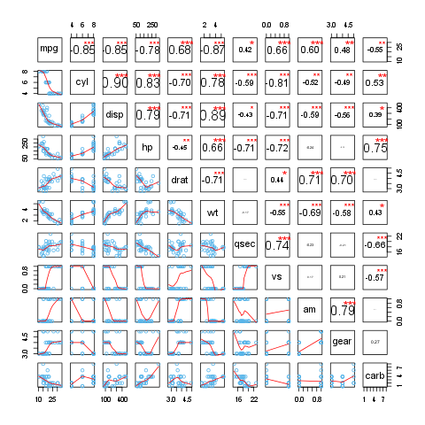

% Correlations
% Rapport package team @ https://github.com/aL3xa/rapport
% 2011-04-26 20:25 CET

Description
-----------

This template will return the correlation matrix of supplied numerical
variables.

Variable description
--------------------

*3* variables provided.

The highest correlation coefficient (0.2273) is between *edu* and *age*
and the lowest (-0.0338) is between *leisure* and *age*. It seems that
the strongest association (r=0.2273) is between *edu* and *age*.

Highly correlated (r < 0.7 or r \> 0.7) variables: -

Uncorrelated (-0.2 < r < 0.2) variables:

-   *age* and *leisure*
-   *edu* and *leisure*

### Correlation matrix

<!-- endlist -->

            **age**           **edu**           **leisure**
  --------- ----------------- ----------------- -----------------
  age                         0.2273 \* \* \*   -0.0338
  edu       0.2273 \* \* \*                     0.1732 \* \* \*
  leisure   -0.0338           0.1732 \* \* \*   

Description
-----------

This template will return the correlation matrix of supplied numerical
variables.

Variable description
--------------------

*11* variables provided.

The highest correlation coefficient (0.902) is between *disp* and *cyl*
and the lowest (-0.8677) is between *wt* and *mpg*. It seems that the
strongest association (r=0.902) is between *disp* and *cyl*.

Highly correlated (r < 0.7 or r \> 0.7) variables:

-   *mpg* and *cyl*
-   *mpg* and *disp*
-   *cyl* and *disp*
-   *mpg* and *hp*
-   *cyl* and *hp*
-   *disp* and *hp*
-   *disp* and *drat*
-   *mpg* and *wt*
-   *cyl* and *wt*
-   *disp* and *wt*
-   *drat* and *wt*
-   *hp* and *qsec*
-   *cyl* and *vs*
-   *disp* and *vs*
-   *hp* and *vs*
-   *qsec* and *vs*
-   *drat* and *am*
-   *am* and *gear*
-   *hp* and *carb*

Uncorrelated (-0.2 < r < 0.2) variables:

-   *drat* and *qsec*
-   *wt* and *qsec*
-   *vs* and *am*
-   *hp* and *gear*
-   *drat* and *carb*
-   *am* and *carb*

### Correlation matrix

<!-- endlist -->

         **mpg**            **cyl**            **disp**           **hp**             **drat**           **wt**             **qsec**           **vs**             **am**             **gear**           **carb**
  ------ ------------------ ------------------ ------------------ ------------------ ------------------ ------------------ ------------------ ------------------ ------------------ ------------------ ------------------
  mpg                       -0.8522 \* \* \*   -0.8476 \* \* \*   -0.7762 \* \* \*   0.6812 \* \* \*    -0.8677 \* \* \*   0.4187 \*          0.6640 \* \* \*    0.5998 \* \* \*    0.4803 \* \*       -0.5509 \* \*
  cyl    -0.8522 \* \* \*                      0.9020 \* \* \*    0.8324 \* \* \*    -0.6999 \* \* \*   0.7825 \* \* \*    -0.5912 \* \* \*   -0.8108 \* \* \*   -0.5226 \* \*      -0.4927 \* \*      0.5270 \* \*
  disp   -0.8476 \* \* \*   0.9020 \* \* \*                       0.7909 \* \* \*    -0.7102 \* \* \*   0.8880 \* \* \*    -0.4337 \*         -0.7104 \* \* \*   -0.5912 \* \* \*   -0.5556 \* \* \*   0.3950 \*
  hp     -0.7762 \* \* \*   0.8324 \* \* \*    0.7909 \* \* \*                       -0.4488 \* \*      0.6587 \* \* \*    -0.7082 \* \* \*   -0.7231 \* \* \*   -0.2432            -0.1257            0.7498 \* \* \*
  drat   0.6812 \* \* \*    -0.6999 \* \* \*   -0.7102 \* \* \*   -0.4488 \* \*                         -0.7124 \* \* \*   0.0912             0.4403 \*          0.7127 \* \* \*    0.6996 \* \* \*    -0.0908
  wt     -0.8677 \* \* \*   0.7825 \* \* \*    0.8880 \* \* \*    0.6587 \* \* \*    -0.7124 \* \* \*                      -0.1747            -0.5549 \* \* \*   -0.6925 \* \* \*   -0.5833 \* \* \*   0.4276 \*
  qsec   0.4187 \*          -0.5912 \* \* \*   -0.4337 \*         -0.7082 \* \* \*   0.0912             -0.1747                               0.7445 \* \* \*    -0.2299            -0.2127            -0.6562 \* \* \*
  vs     0.6640 \* \* \*    -0.8108 \* \* \*   -0.7104 \* \* \*   -0.7231 \* \* \*   0.4403 \*          -0.5549 \* \* \*   0.7445 \* \* \*                       0.1683             0.2060             -0.5696 \* \* \*
  am     0.5998 \* \* \*    -0.5226 \* \*      -0.5912 \* \* \*   -0.2432            0.7127 \* \* \*    -0.6925 \* \* \*   -0.2299            0.1683                                0.7941 \* \* \*    0.0575
  gear   0.4803 \* \*       -0.4927 \* \*      -0.5556 \* \* \*   -0.1257            0.6996 \* \* \*    -0.5833 \* \* \*   -0.2127            0.2060             0.7941 \* \* \*                       0.2741
  carb   -0.5509 \* \*      0.5270 \* \*       0.3950 \*          0.7498 \* \* \*    -0.0908            0.4276 \*          -0.6562 \* \* \*   -0.5696 \* \* \*   0.0575             0.2741             

* * * * *

This report was generated with [R](http://www.r-project.org/) (2.14.0)
and [rapport](http://al3xa.github.com/rapport/) (0.2) in 1.728 sec on
x86\_64-unknown-linux-gnu platform.

