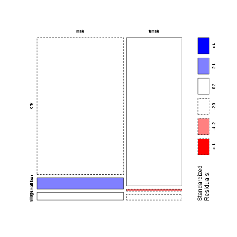
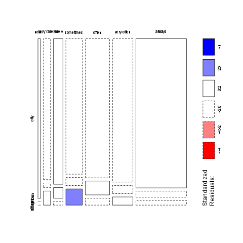

% Crosstable
% Rapport package team @ https://github.com/aL3xa/rapport
% 2011-04-26 20:25 CET

Description
-----------

Returning the Chi-squared test of two given variables with count,
percentages and Pearson's residuals table.

Variable description
--------------------

Two variables specified:

-   "gender" ("Gender") with *673* and
-   "dwell" ("Dwelling") with *662* valid values.

Counts
------

<!-- endlist -->

           **city**   **small town**   **village**
  -------- ---------- ---------------- -------------
  male     338        28               19
  female   234        3                9

Percentages
-----------

<!-- endlist -->

           **city**   **small town**   **village**
  -------- ---------- ---------------- -------------
  male     0.5357     0.0444           0.0301
  female   0.3708     0.0048           0.0143

### Row percentages

<!-- endlist -->

           **city**   **small town**   **village**
  -------- ---------- ---------------- -------------
  male     0.8779     0.0727           0.0494
  female   0.9512     0.0122           0.0366

### Column percentages

<!-- endlist -->

           **city**   **small town**   **village**
  -------- ---------- ---------------- -------------
  male     0.5909     0.9032           0.6786
  female   0.4091     0.0968           0.3214

Chi-squared test
----------------

              **X-squared**   **df**   **p-value**
  ----------- --------------- -------- -------------
  X-squared   12.6353         2        0.0018

It seems that a real association can be pointed out between *gender* and
*dwell* by the *Pearson's Chi-squared test* (χ=12.6353 at the degree of
freedom being 2) at the significance level of 0.0018. Based on Goodman
and Kruskal's lambda it seems that *dwell* (λ=0.7602) has an effect on
*gender* (λ=0) if we assume both variables to be nominal. The
association between the two variables seems to be weak based on Cramer's
V (0.1001).

### Pearson's residuals

<!-- endlist -->

           **city**   **small town**   **village**
  -------- ---------- ---------------- -------------
  male     -3.0844    3.4312           0.7595
  female   3.0844     -3.4312          -0.7595

### Mosaic chart

Description
-----------

Returning the Chi-squared test of two given variables with count,
percentages and Pearson's residuals table.

Variable description
--------------------

Two variables specified:

-   "email" ("Email usage") with *672* and
-   "dwell" ("Dwelling") with *662* valid values.

Counts
------

<!-- endlist -->

                **city**   **small town**   **village**
  ------------- ---------- ---------------- -------------
  never         12         0                0
  very rarely   30         1                3
  rarely        41         3                1
  sometimes     67         4                8
  often         101        10               5
  very often    88         5                5
  always        226        9                7

Percentages
-----------

<!-- endlist -->

                **city**   **small town**   **village**
  ------------- ---------- ---------------- -------------
  never         0.0192     0.0000           0.0000
  very rarely   0.0479     0.0016           0.0048
  rarely        0.0655     0.0048           0.0016
  sometimes     0.1070     0.0064           0.0128
  often         0.1613     0.0160           0.0080
  very often    0.1406     0.0080           0.0080
  always        0.3610     0.0144           0.0112

### Row percentages

<!-- endlist -->

                **city**   **small town**   **village**
  ------------- ---------- ---------------- -------------
  never         1.0000     0.0000           0.0000
  very rarely   0.8824     0.0294           0.0882
  rarely        0.9111     0.0667           0.0222
  sometimes     0.8481     0.0506           0.1013
  often         0.8707     0.0862           0.0431
  very often    0.8980     0.0510           0.0510
  always        0.9339     0.0372           0.0289

### Column percentages

<!-- endlist -->

                **city**   **small town**   **village**
  ------------- ---------- ---------------- -------------
  never         0.0212     0.0000           0.0000
  very rarely   0.0531     0.0312           0.1034
  rarely        0.0726     0.0938           0.0345
  sometimes     0.1186     0.1250           0.2759
  often         0.1788     0.3125           0.1724
  very often    0.1558     0.1562           0.1724
  always        0.4000     0.2812           0.2414

Chi-squared test
----------------

              **X-squared**   **df**   **p-value**
  ----------- --------------- -------- -------------
  X-squared   14.864          12       0.249

It seems that no real association can be pointed out between *email* and
*dwell* by the *Pearson's Chi-squared test* (χ=14.864 at the degree of
freedom being 12) at the significance level of 0.249. For this end no
other statistical tests were performed.

### Pearson's residuals

<!-- endlist -->

                **city**   **small town**   **village**
  ------------- ---------- ---------------- -------------
  never         1.1493     -0.8118          -0.7709
  very rarely   -0.4085    -0.5910          1.1955
  rarely        0.2009     0.4916           -0.7985
  sometimes     -1.7459    -0.0210          2.4853
  often         -1.2822    1.9011           -0.1829
  very often    -0.1671    -0.0048          0.2407
  always        2.0982     -1.2561          -1.6443

### Mosaic chart

* * * * *

This report was generated with [R](http://www.r-project.org/) (2.14.0)
and [rapport](http://al3xa.github.com/rapport/) (0.1) in 0.379 sec on
x86\_64-unknown-linux-gnu platform.

