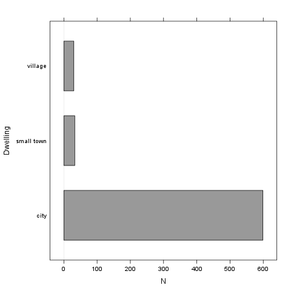

% Descriptive statistics
% Rapport package team @ https://github.com/aL3xa/rapport
% 2011-04-26 20:25 CET

Description
-----------

This template will return descriptive statistics and frequency table of
a categorical variable.

*gender* ("Gender")
-------------------

The dataset has *709* observations with *673* valid values (missing:
*36*) in *gender* ("Gender"), which seems to be a qualitative variable.

### Base statistics

  **gender**   **N**   **%**     **Cumul. N**   **Cumul. %**
  ------------ ------- --------- -------------- --------------
  male         410     60.9212   410            60.9212
  female       263     39.0788   673            100
  Total        673     100       673            100

### Barplot

It seems that the highest value is *2* which is exactly 2 times higher
than the smallest value (*1*).

The most frequent value is *male*.

Description
-----------

This template will return descriptive statistics and frequency table of
a categorical variable.

*dwell* ("Dwelling")
--------------------

The dataset has *709* observations with *662* valid values (missing:
*47*) in *dwell* ("Dwelling"), which seems to be a qualitative variable.

### Base statistics

  **dwell**    **N**   **%**     **Cumul. N**   **Cumul. %**
  ------------ ------- --------- -------------- --------------
  city         599     90.4834   599            90.4834
  small town   33      4.9849    632            95.4683
  village      30      4.5317    662            100
  Total        662     100       662            100

### Barplot

It seems that the highest value is *3* which is exactly 3 times higher
than the smallest value (*1*).

The most frequent value is *city*.

* * * * *

This report was generated in [R](http://www.r-project.org/) with
[Rapport](http://al3xa.github.com/rapport/) in 0.269 sec. Feel free to
create [your own reporting
templates](http://al3xa.github.com/rapport/#custom)!

