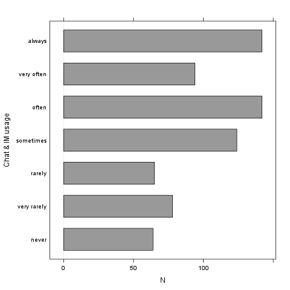
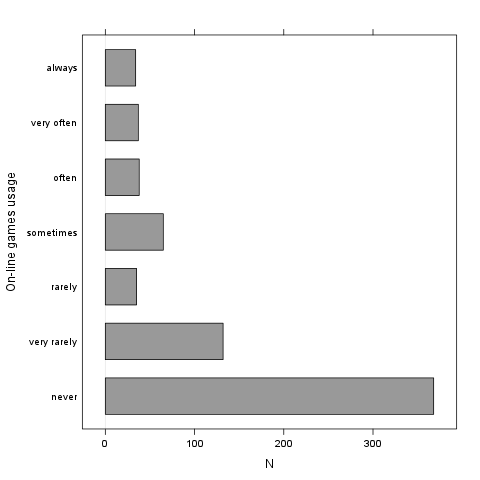
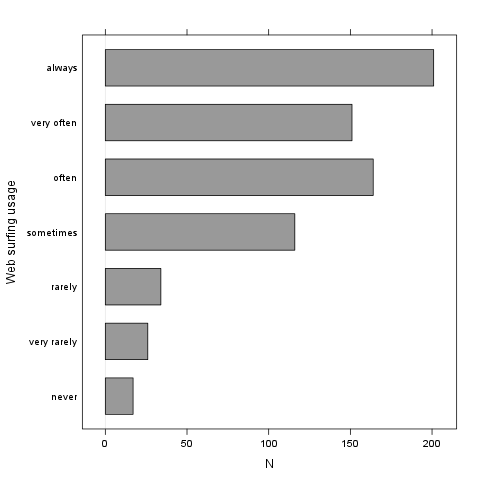
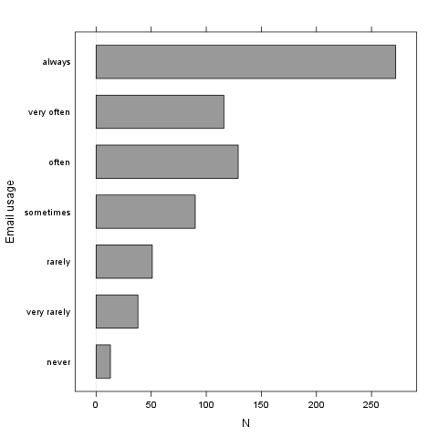
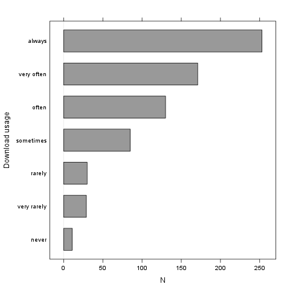
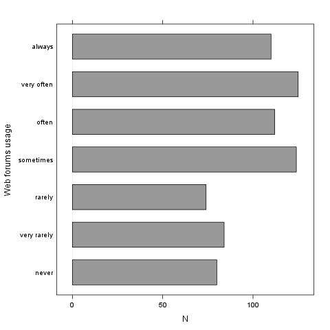
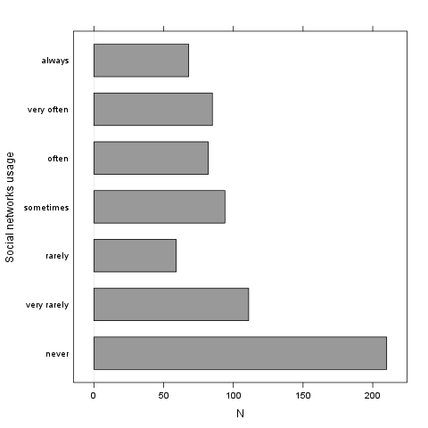
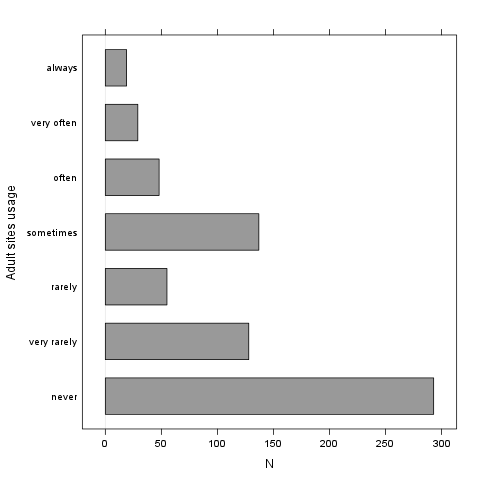

% Descriptives
% Rapport package team @ https://github.com/aL3xa/rapport
% 2011-04-26 20:25 CET

## Description

This template will return descriptive statistics of numerical, or
frequency tables of categorical variables.

### *gender* ("Gender")

The dataset has 709 observations with 709 valid values (missing: 0) in
*gender* ("Gender"). This variable seems to be a factor.

#### Base statistics

          **gender**   **N**    **pct**   **cumul.count**   **cumul.pct**
  ------- ------------ -------- --------- ----------------- ---------------
  1       male         432.00   60.93     432.00            60.93
  2       female       277.00   39.07     709.00            100.00
  Total                709.00   100.00    709.00            100.00

#### Barplot

It seems that the highest value is 2 which is exactly 2 times higher
than the smallest value (1).

### *age* ("Age")

The dataset has 709 observations with 709 valid values (missing: 0) in
*age* ("Age"). This variable seems to be numeric.

#### Base statistics

  **value**   **mean(age)**   **sd(age)**   **var(age)**
  ----------- --------------- ------------- --------------
  (all)       24.56           6.84          46.78

#### Histogram

It seems that the highest value is 58 which is exactly 3.625 times
higher than the smallest value (16).

The standard deviation is 6.8399 (variance: 46.784). The expected value
is around 24.557, somewhere between 24.054 and 25.061 (SE: 0.2569).

If we suppose that *Age* is not near to a normal distribution (test: ,
skewness: 1.9568, kurtosis: 7.6428), checking the median (23) might be a
better option instead of the mean. The interquartile range (6) measures
the statistics dispersion of the variable (similar to standard
deviation) based on median.

## Description

This template will return descriptive statistics of numerical, or
frequency tables of categorical variables.

### *chatim* ("Chat & IM usage")

The dataset has 709 observations with 709 valid values (missing: 0) in
*chatim* ("Chat & IM usage"). This variable seems to be a factor.

#### Base statistics

          **chatim**    **N**    **pct**   **cumul.count**   **cumul.pct**
  ------- ------------- -------- --------- ----------------- ---------------
  1       never         64.00    9.03      64.00             9.03
  2       very rarely   78.00    11.00     142.00            20.03
  3       rarely        65.00    9.17      207.00            29.20
  4       sometimes     124.00   17.49     331.00            46.69
  5       often         142.00   20.03     473.00            66.71
  6       very often    94.00    13.26     567.00            79.97
  7       always        142.00   20.03     709.00            100.00
  Total                 709.00   100.00    709.00            100.00

#### Barplot

It seems that the highest value is 7 which is exactly 7 times higher
than the smallest value (1).

### *game* ("On-line games usage")

The dataset has 709 observations with 709 valid values (missing: 0) in
*game* ("On-line games usage"). This variable seems to be a factor.

#### Base statistics

          **game**      **N**    **pct**   **cumul.count**   **cumul.pct**
  ------- ------------- -------- --------- ----------------- ---------------
  1       never         368.00   51.90     368.00            51.90
  2       very rarely   132.00   18.62     500.00            70.52
  3       rarely        35.00    4.94      535.00            75.46
  4       sometimes     65.00    9.17      600.00            84.63
  5       often         38.00    5.36      638.00            89.99
  6       very often    37.00    5.22      675.00            95.20
  7       always        34.00    4.80      709.00            100.00
  Total                 709.00   100.00    709.00            100.00

#### Barplot

It seems that the highest value is 7 which is exactly 7 times higher
than the smallest value (1).

### *surf* ("Web surfing usage")

The dataset has 709 observations with 709 valid values (missing: 0) in
*surf* ("Web surfing usage"). This variable seems to be a factor.

#### Base statistics

          **surf**      **N**    **pct**   **cumul.count**   **cumul.pct**
  ------- ------------- -------- --------- ----------------- ---------------
  1       never         17.00    2.40      17.00             2.40
  2       very rarely   26.00    3.67      43.00             6.06
  3       rarely        34.00    4.80      77.00             10.86
  4       sometimes     116.00   16.36     193.00            27.22
  5       often         164.00   23.13     357.00            50.35
  6       very often    151.00   21.30     508.00            71.65
  7       always        201.00   28.35     709.00            100.00
  Total                 709.00   100.00    709.00            100.00

#### Barplot

It seems that the highest value is 7 which is exactly 7 times higher
than the smallest value (1).

### *email* ("Email usage")

The dataset has 709 observations with 709 valid values (missing: 0) in
*email* ("Email usage"). This variable seems to be a factor.

#### Base statistics

          **email**     **N**    **pct**   **cumul.count**   **cumul.pct**
  ------- ------------- -------- --------- ----------------- ---------------
  1       never         13.00    1.83      13.00             1.83
  2       very rarely   38.00    5.36      51.00             7.19
  3       rarely        51.00    7.19      102.00            14.39
  4       sometimes     90.00    12.69     192.00            27.08
  5       often         129.00   18.19     321.00            45.28
  6       very often    116.00   16.36     437.00            61.64
  7       always        272.00   38.36     709.00            100.00
  Total                 709.00   100.00    709.00            100.00

#### Barplot

It seems that the highest value is 7 which is exactly 7 times higher
than the smallest value (1).

### *download* ("Download usage")

The dataset has 709 observations with 709 valid values (missing: 0) in
*download* ("Download usage"). This variable seems to be a factor.

#### Base statistics

          **download**   **N**    **pct**   **cumul.count**   **cumul.pct**
  ------- -------------- -------- --------- ----------------- ---------------
  1       never          11.00    1.55      11.00             1.55
  2       very rarely    29.00    4.09      40.00             5.64
  3       rarely         30.00    4.23      70.00             9.87
  4       sometimes      85.00    11.99     155.00            21.86
  5       often          130.00   18.34     285.00            40.20
  6       very often     171.00   24.12     456.00            64.32
  7       always         253.00   35.68     709.00            100.00
  Total                  709.00   100.00    709.00            100.00

#### Barplot

It seems that the highest value is 7 which is exactly 7 times higher
than the smallest value (1).

### *forum* ("Web forums usage")

The dataset has 709 observations with 709 valid values (missing: 0) in
*forum* ("Web forums usage"). This variable seems to be a factor.

#### Base statistics

          **forum**     **N**    **pct**   **cumul.count**   **cumul.pct**
  ------- ------------- -------- --------- ----------------- ---------------
  1       never         80.00    11.28     80.00             11.28
  2       very rarely   84.00    11.85     164.00            23.13
  3       rarely        74.00    10.44     238.00            33.57
  4       sometimes     124.00   17.49     362.00            51.06
  5       often         112.00   15.80     474.00            66.85
  6       very often    125.00   17.63     599.00            84.49
  7       always        110.00   15.51     709.00            100.00
  Total                 709.00   100.00    709.00            100.00

#### Barplot

It seems that the highest value is 7 which is exactly 7 times higher
than the smallest value (1).

### *socnet* ("Social networks usage")

The dataset has 709 observations with 709 valid values (missing: 0) in
*socnet* ("Social networks usage"). This variable seems to be a factor.

#### Base statistics

          **socnet**    **N**    **pct**   **cumul.count**   **cumul.pct**
  ------- ------------- -------- --------- ----------------- ---------------
  1       never         210.00   29.62     210.00            29.62
  2       very rarely   111.00   15.66     321.00            45.28
  3       rarely        59.00    8.32      380.00            53.60
  4       sometimes     94.00    13.26     474.00            66.85
  5       often         82.00    11.57     556.00            78.42
  6       very often    85.00    11.99     641.00            90.41
  7       always        68.00    9.59      709.00            100.00
  Total                 709.00   100.00    709.00            100.00

#### Barplot

It seems that the highest value is 7 which is exactly 7 times higher
than the smallest value (1).

### *xxx* ("Adult sites usage")

The dataset has 709 observations with 709 valid values (missing: 0) in
*xxx* ("Adult sites usage"). This variable seems to be a factor.

#### Base statistics

          **xxx**       **N**    **pct**   **cumul.count**   **cumul.pct**
  ------- ------------- -------- --------- ----------------- ---------------
  1       never         293.00   41.33     293.00            41.33
  2       very rarely   128.00   18.05     421.00            59.38
  3       rarely        55.00    7.76      476.00            67.14
  4       sometimes     137.00   19.32     613.00            86.46
  5       often         48.00    6.77      661.00            93.23
  6       very often    29.00    4.09      690.00            97.32
  7       always        19.00    2.68      709.00            100.00
  Total                 709.00   100.00    709.00            100.00

#### Barplot

It seems that the highest value is 7 which is exactly 7 times higher
than the smallest value (1).
