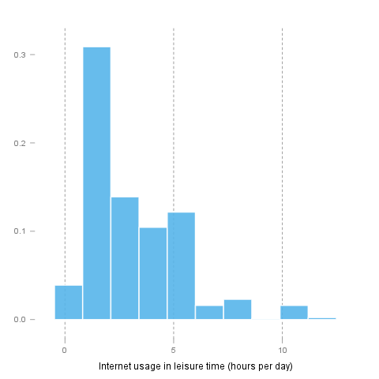
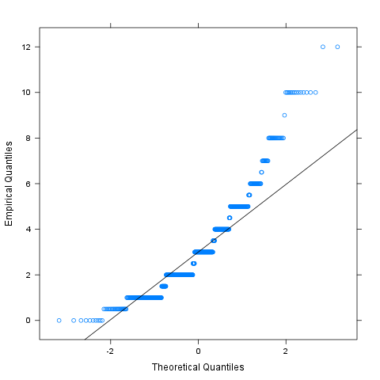
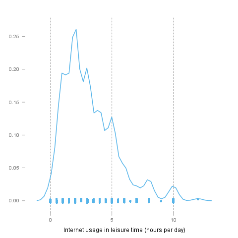
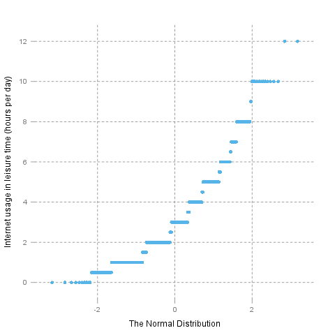
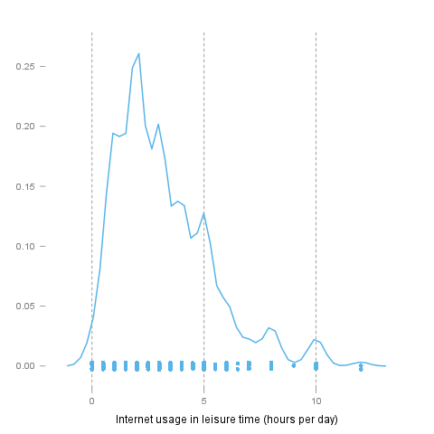

% Normality Tests
% Rapport package team @ https://github.com/aL3xa/rapport
% 2011-04-26 20:25 CET

Description
-----------

Overview of several normality tests and diagnostic plots that can screen
departures from normality.

Introduction
------------

In statistics, *normality* refers to an assumption that the distribution
of a random variable follows *normal* (*Gaussian*) distribution. Because
of its bell-like shape, it's also known as the *"bell curve"*. The
formula for *normal distribution* is:

$$f(x) = \frac{1}{\sqrt{2\pi{}\sigma{}^2}} e^{-\frac{(x-\mu{})^2}{2\sigma{}^2}}$$

*Normal distribution* belongs to a *location-scale family* of
distributions, as it's defined two parameters:

-   *μ* - *mean* or *expectation* (location parameter)
-   *σ^2^* - *variance* (scale parameter)

Normality Tests
---------------

### Overview

Various hypothesis tests can be applied in order to test if the
distribution of given random variable violates normality assumption.
These procedures test the H~0~ that provided variable's distribution is
*normal*. At this point only few such tests will be covered: the ones
that are available in `stats` package (which comes bundled with default
R installation) and `nortest` package that is
[available](http://cran.r-project.org/web/packages/nortest/index.html)
on CRAN.

-   **Shapiro-Wilk test** is a powerful normality test appropriate for
    small samples. In R, it's implemented in `shapiro.test` function
    available in `stats` package.
-   **Lilliefors test** is a modification of *Kolmogorov-Smirnov test*
    appropriate for testing normality when parameters or normal
    distribution (*μ*, *σ^2^*) are not known. `lillie.test` function is
    located in `nortest` package.
-   **Anderson-Darling test** is one of the most powerful normality
    tests as it will detect the most of departures from normality. You
    can find `ad.test` function in `nortest` package.
-   **Pearson Χ^2^ test** is another normality test which takes more
    "traditional" approach in normality testing. `pearson.test` is
    located in `nortest` package.

### Results

Here you can see the results of applied normality tests (*p-values* less
than 0.05 indicate significant discrepancies):

*0.05*

So, let's draw some conclusions based on applied normality test:

-   according to *Shapiro-Wilk test*, the distribution of *Internet
    usage in leisure time (hours per day)* is not normal.
-   based on *Lilliefors test*, distribution of *Internet usage in
    leisure time (hours per day)* is not normal
-   *Anderson-Darling test* confirms violation of normality assumption
-   *Pearson's Χ^2^ test* classifies the underlying distribution as
    normal

Diagnostic Plots
----------------

There are various plots that can help you decide about the normality of
the distribution. Only a few most commonly used plots will be shown:
*histogram*, *Q-Q plot* and *kernel density plot*.

### Histogram

*Histogram* was first introduced by *Karl Pearson* and it's probably the
most popular plot for depicting the probability distribution of a random
variable. However, the decision depends on number of bins, so it can
sometimes be misleading. If the variable distribution is normal, bins
should resemble the "bell-like" shape.

### Q-Q Plot

"Q" in *Q-Q plot* stands for *quantile*, as this plot compares empirical
and theoretical distribution (in this case, *normal* distribution) by
plotting their quantiles against each other. For normal distribution,
plotted dots should approximate a "straight", `x = y` line.

### Kernel Density Plot

*Kernel density plot* is a plot of smoothed *empirical distribution
function*. As such, it provides good insight about the shape of the
distribution. For normal distributions, it should resemble the well
known "bell shape".

Description
-----------

Overview of several normality tests and diagnostic plots that can screen
departures from normality.

Introduction
------------

In statistics, *normality* refers to an assumption that the distribution
of a random variable follows *normal* (*Gaussian*) distribution. Because
of its bell-like shape, it's also known as the *"bell curve"*. The
formula for *normal distribution* is:

$$f(x) = \frac{1}{\sqrt{2\pi{}\sigma{}^2}} e^{-\frac{(x-\mu{})^2}{2\sigma{}^2}}$$

*Normal distribution* belongs to a *location-scale family* of
distributions, as it's defined two parameters:

-   *μ* - *mean* or *expectation* (location parameter)
-   *σ^2^* - *variance* (scale parameter)

Normality Tests
---------------

### Overview

Various hypothesis tests can be applied in order to test if the
distribution of given random variable violates normality assumption.
These procedures test the H~0~ that provided variable's distribution is
*normal*. At this point only few such tests will be covered: the ones
that are available in `stats` package (which comes bundled with default
R installation) and `nortest` package that is
[available](http://cran.r-project.org/web/packages/nortest/index.html)
on CRAN.

-   **Shapiro-Wilk test** is a powerful normality test appropriate for
    small samples. In R, it's implemented in `shapiro.test` function
    available in `stats` package.
-   **Lilliefors test** is a modification of *Kolmogorov-Smirnov test*
    appropriate for testing normality when parameters or normal
    distribution (*μ*, *σ^2^*) are not known. `lillie.test` function is
    located in `nortest` package.
-   **Anderson-Darling test** is one of the most powerful normality
    tests as it will detect the most of departures from normality. You
    can find `ad.test` function in `nortest` package.
-   **Pearson Χ^2^ test** is another normality test which takes more
    "traditional" approach in normality testing. `pearson.test` is
    located in `nortest` package.

### Results

Here you can see the results of applied normality tests (*p-values* less
than 0.05 indicate significant discrepancies):

*0.05*

So, let's draw some conclusions based on applied normality test:

-   according to *Shapiro-Wilk test*, the distribution of *Internet
    usage in leisure time (hours per day)* is not normal.
-   based on *Lilliefors test*, distribution of *Internet usage in
    leisure time (hours per day)* is not normal
-   *Anderson-Darling test* confirms violation of normality assumption
-   *Pearson's Χ^2^ test* classifies the underlying distribution as
    normal

Diagnostic Plots
----------------

There are various plots that can help you decide about the normality of
the distribution. Only a few most commonly used plots will be shown:
*histogram*, *Q-Q plot* and *kernel density plot*.

### Histogram

*Histogram* was first introduced by *Karl Pearson* and it's probably the
most popular plot for depicting the probability distribution of a random
variable. However, the decision depends on number of bins, so it can
sometimes be misleading. If the variable distribution is normal, bins
should resemble the "bell-like" shape.

### Q-Q Plot

"Q" in *Q-Q plot* stands for *quantile*, as this plot compares empirical
and theoretical distribution (in this case, *normal* distribution) by
plotting their quantiles against each other. For normal distribution,
plotted dots should approximate a "straight", `x = y` line.

### Kernel Density Plot

*Kernel density plot* is a plot of smoothed *empirical distribution
function*. As such, it provides good insight about the shape of the
distribution. For normal distributions, it should resemble the well
known "bell shape".

Description
-----------

Overview of several normality tests and diagnostic plots that can screen
departures from normality.

Introduction
------------

In statistics, *normality* refers to an assumption that the distribution
of a random variable follows *normal* (*Gaussian*) distribution. Because
of its bell-like shape, it's also known as the *"bell curve"*. The
formula for *normal distribution* is:

$$f(x) = \frac{1}{\sqrt{2\pi{}\sigma{}^2}} e^{-\frac{(x-\mu{})^2}{2\sigma{}^2}}$$

*Normal distribution* belongs to a *location-scale family* of
distributions, as it's defined two parameters:

-   *μ* - *mean* or *expectation* (location parameter)
-   *σ^2^* - *variance* (scale parameter)

Normality Tests
---------------

### Overview

Various hypothesis tests can be applied in order to test if the
distribution of given random variable violates normality assumption.
These procedures test the H~0~ that provided variable's distribution is
*normal*. At this point only few such tests will be covered: the ones
that are available in `stats` package (which comes bundled with default
R installation) and `nortest` package that is
[available](http://cran.r-project.org/web/packages/nortest/index.html)
on CRAN.

-   **Shapiro-Wilk test** is a powerful normality test appropriate for
    small samples. In R, it's implemented in `shapiro.test` function
    available in `stats` package.
-   **Lilliefors test** is a modification of *Kolmogorov-Smirnov test*
    appropriate for testing normality when parameters or normal
    distribution (*μ*, *σ^2^*) are not known. `lillie.test` function is
    located in `nortest` package.
-   **Anderson-Darling test** is one of the most powerful normality
    tests as it will detect the most of departures from normality. You
    can find `ad.test` function in `nortest` package.
-   **Pearson Χ^2^ test** is another normality test which takes more
    "traditional" approach in normality testing. `pearson.test` is
    located in `nortest` package.

### Results

Here you can see the results of applied normality tests (*p-values* less
than 0.05 indicate significant discrepancies):

*0.05*

So, let's draw some conclusions based on applied normality test:

-   according to *Shapiro-Wilk test*, the distribution of *Internet
    usage in leisure time (hours per day)* is not normal.
-   based on *Lilliefors test*, distribution of *Internet usage in
    leisure time (hours per day)* is not normal
-   *Anderson-Darling test* confirms violation of normality assumption
-   *Pearson's Χ^2^ test* classifies the underlying distribution as
    normal

Diagnostic Plots
----------------

There are various plots that can help you decide about the normality of
the distribution. Only a few most commonly used plots will be shown:
*histogram*, *Q-Q plot* and *kernel density plot*.

### Histogram

*Histogram* was first introduced by *Karl Pearson* and it's probably the
most popular plot for depicting the probability distribution of a random
variable. However, the decision depends on number of bins, so it can
sometimes be misleading. If the variable distribution is normal, bins
should resemble the "bell-like" shape.

### Q-Q Plot

"Q" in *Q-Q plot* stands for *quantile*, as this plot compares empirical
and theoretical distribution (in this case, *normal* distribution) by
plotting their quantiles against each other. For normal distribution,
plotted dots should approximate a "straight", `x = y` line.

### Kernel Density Plot

*Kernel density plot* is a plot of smoothed *empirical distribution
function*. As such, it provides good insight about the shape of the
distribution. For normal distributions, it should resemble the well
known "bell shape".

* * * * *

This report was generated with [R](http://www.r-project.org/) (2.14.0)
and [rapport](http://al3xa.github.com/rapport/) (0.1) in 2.914 sec on
x86\_64-unknown-linux-gnu platform.

