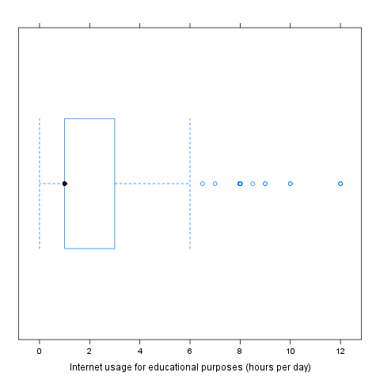

% Outlier test
% Rapport package team @ https://github.com/aL3xa/rapport
% 2011-04-26 20:25 CET

## Description

This template will check if provided variable has any outliers.

### Boxplot

### Lund test

It seems that 5 extreme values can be found in "Internet usage for
educational purposes (hours per day)". These are: 10, 10, 12, 12, 12.

#### Explanation

The above test for outliers was based on *lm(1 \~ edu)*:

                **Estimate**   **Std. Error**   **t value**   **Pr(\>|t|)**
  ------------- -------------- ---------------- ------------- ---------------
  (Intercept)   2.06           0.08             26.92         0.00

#### References

-   Lund, R. E. 1975, "Tables for An Approximate Test for Outliers in
    Linear Models", Technometrics, vol. 17, no. 4, pp. 473-476.
-   Prescott, P. 1975, "An Approximate Test for Outliers in Linear
    Models", Technometrics, vol. 17, no. 1, pp. 129-132.

### Grubb's test

Grubbs test for one outlier shows that highest value 12 is an outlier
(p=0.0003).

#### References

-   Grubbs, F.E. (1950). Sample Criteria for testing outlying
    observations. Ann. Math. Stat. 21, 1, 27-58.

### Dixon's test

chi-squared test for outlier shows that highest value 12 is an outlier
(p=0).

#### References

-   Dixon, W.J. (1950). Analysis of extreme values. Ann. Math. Stat. 21,
    4, 488-506.

## Description

This template will check if provided variable has any outliers.

### Boxplot

### Lund test

It seems that 5 extreme values can be found in "Internet usage for
educational purposes (hours per day)". These are: 10, 10, 12, 12, 12.

#### Explanation

The above test for outliers was based on *lm(1 \~ edu)*:

                **Estimate**   **Std. Error**   **t value**   **Pr(\>|t|)**
  ------------- -------------- ---------------- ------------- ---------------
  (Intercept)   2.06           0.08             26.92         0.00

#### References

-   Lund, R. E. 1975, "Tables for An Approximate Test for Outliers in
    Linear Models", Technometrics, vol. 17, no. 4, pp. 473-476.
-   Prescott, P. 1975, "An Approximate Test for Outliers in Linear
    Models", Technometrics, vol. 17, no. 1, pp. 129-132.

### Grubb's test

Grubbs test for one outlier shows that highest value 12 is an outlier
(p=0.0003).

#### References

-   Grubbs, F.E. (1950). Sample Criteria for testing outlying
    observations. Ann. Math. Stat. 21, 1, 27-58.

### Dixon's test

chi-squared test for outlier shows that highest value 12 is an outlier
(p=0).

#### References

-   Dixon, W.J. (1950). Analysis of extreme values. Ann. Math. Stat. 21,
    4, 488-506.

## Description

This template will check if provided variable has any outliers.

### Boxplot

### Lund test

It seems that 5 extreme values can be found in "Internet usage for
educational purposes (hours per day)". These are: 10, 10, 12, 12, 12.

#### Explanation

The above test for outliers was based on *lm(1 \~ edu)*:

                **Estimate**   **Std. Error**   **t value**   **Pr(\>|t|)**
  ------------- -------------- ---------------- ------------- ---------------
  (Intercept)   2.06           0.08             26.92         0.00

