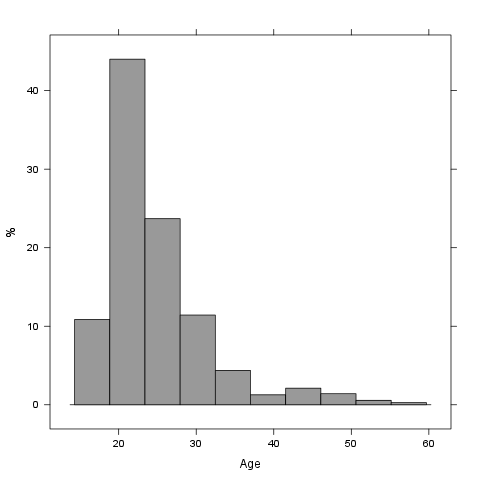

% Descriptives
% Rapport package team @ https://github.com/aL3xa/rapport
% 2011-04-26 20:25 CET

## Description

This template will return descriptive statistics of a numerical, or a
frequency table of a categorical variable.

### *gender* ("Gender")

The dataset has 709 observations with 709 valid values (missing: 0) in
*gender* ("Gender"). This variable seems to be a factor.

#### Base statistics

          **gender**   **N**    **pct**   **cumul.count**   **cumul.pct**
  ------- ------------ -------- --------- ----------------- ---------------
  1       male         432.00   60.93     432.00            60.93
  2       female       277.00   39.07     709.00            100.00
  Total                709.00   100.00    709.00            100.00

#### Barplot

It seems that the highest value is 2 which is exactly 2 times higher
than the smallest value (1).

## Description

This template will return descriptive statistics of a numerical, or a
frequency table of a categorical variable.

### *age* ("Age")

The dataset has 709 observations with 709 valid values (missing: 0) in
*age* ("Age"). This variable seems to be numeric.

#### Base statistics

  **value**   **mean(age)**   **sd(age)**   **var(age)**
  ----------- --------------- ------------- --------------
  (all)       24.56           6.84          46.78

#### Histogram

It seems that the highest value is 58 which is exactly 3.625 times
higher than the smallest value (16).

The standard deviation is 6.8399 (variance: 46.784). The expected value
is around 24.557, somewhere between 24.054 and 25.061 (SE: 0.2569).

If we suppose that *Age* is not near to a normal distribution (test: ,
skewness: 1.9568, kurtosis: 7.6428), checking the median (23) might be a
better option instead of the mean. The interquartile range (6) measures
the statistics dispersion of the variable (similar to standard
deviation) based on median.
