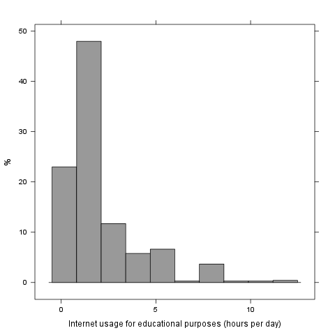

% Descriptives
% Rapport package team @ https://github.com/aL3xa/rapport
% 2011-04-26 20:25 CET

## Description

This template will return descriptive statistics of a numerical, or a
frequency table of a categorical variable.

### Variable description

The dataset has 709 observations with 709 valid values (missing: 0) in
"it.edu" ("Internet usage for educational purposes (hours per day)").
This variable seems to be numeric.

### Base statistics

      **0**      **0.5**     **1**       **1.5**    **2**       **2.5**    **3**      **3.5**   **4**      **4.5**   **5**      **5.5**   **6**      **6.5**   **7**     **8**      **8.5**   **9**     **10**    **12**
  --- ---------- ----------- ----------- ---------- ----------- ---------- ---------- --------- ---------- --------- ---------- --------- ---------- --------- --------- ---------- --------- --------- --------- ---------
  1   61.00000   102.00000   204.00000   27.00000   109.00000   17.00000   66.00000   2.00000   37.00000   2.00000   33.00000   1.00000   13.00000   1.00000   1.00000   25.00000   1.00000   2.00000   2.00000   3.00000

### Histogram

It seems that the highest value is 12 which is exactly Inf times higher
than the smalles values (0).

If we suppose that "Internet usage for educational purposes (hours per
day) is not near to a normal distribution (test: , skewness: 1.8593,
kurtosis: 6.8501), checking the median (1) might be a better option
instead of the mean. The interquartile range (2) measures the statistics
dispersion of the variable (similar to standard deviation) based on
median.
